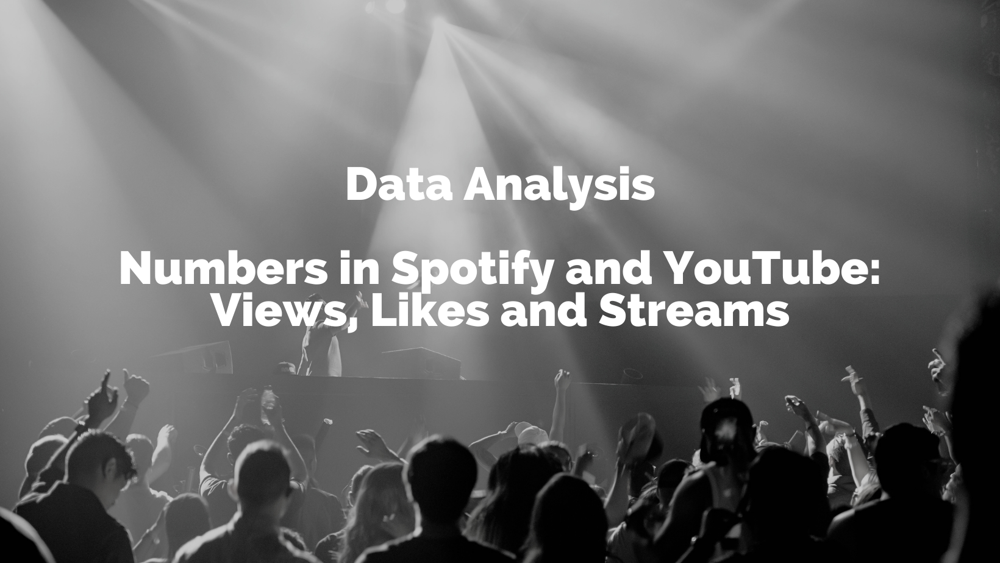

# MH3511 Data Analysis With Computer Group Project

## Data Analysis: Numbers in Spotify and YouTube: Views, Likes and Streams

### Team Member:

- [Iain Roderick Tay](https://github.com/eeyearn)
- [Lee Cheng Yao, Bruise](https://github.com/chengyaolee)
- [Zane Yee Sun](https://github.com/zazzane)
- [Oscar Qian](https://github.com/oscarqjh)

---

### Environment Set up & Dataset (Recommended)

This project is developed with [R](https://www.r-project.org/) and tested on [R Studio](https://posit.co/download/rstudio-desktop/).

The [dataset](https://www.kaggle.com/datasets/salvatorerastelli/spotify-and-youtube/data) used in this project is taken from Kaggle.

---

### Section 1: Introduction & Objective

Music has seen a significant shift in recent times from old record DVDs to now digital music being streamed on multiple platforms such as Spotify and YouTube. Spotify, primarily being an audio and media service provider, provides more than 602 million users with millions of songs from creators all over the world. On the other hand, YouTube, an American online video-sharing and social media platform offers a broad range of content including music videos. This poses an interesting question if there is a correlation between a song’s streams on Spotify with its corresponding YouTube music video.

In our project, a dataset containing the statistics for the Top 10 songs of various Spotify artists and their respective YouTube music videos as of 7th February 2023. Based on this dataset, we aim to answer the following questions around artists’ songs:

- Does the views of YouTube music videos have a correlation to the number of streams on Spotify?
- Do songs on Spotify without music videos on Youtube gain as much popularity as those with music videos?
- Does a song’s Spotify streams depend on the Tempo of the song?
- Is there a single song characteristic that is more important in affecting the streams of the song?

This report will cover the data descriptions and analysis using R language. For each of our research objectives, we performed statistical analysis and concluded the most appropriate approach, together with explanations and elaborations.

---

### Section 2: Statistical Testing

In this project, we utilised multiple statistical testing methods to verify our hypothesis:

1. Paired t-test
2. Welch two-sample t-test
3. Pearson's product-moment correlation
4. Simple linear regression analysis
5. Multiple linear regression analysis

---

### Section 3: Conclusion & Discussion

In the realm of audio entertainment, the intersection of music and video content has become a pivotal arena for attracting audiences and generating revenue. The Spotify and YouTube dataset, offering insights as recent as February 2023, presents a rich tapestry of information that underscores the dynamic characteristics of songs and the music industry. As the music and video streaming platforms continue to evolve, understanding the factors influencing viewership, engagement, and content performance is crucial for stakeholders seeking to adapt and thrive in this competitive landscape. In this report, we delve into the analysis of the Spotify YouTube dataset, aiming to shed light on key aspects related to music streams, music video views, and the evolving digital media ecosystem.

We conclude that:

- Songs tend to have a higher number of Views on YouTube than Streams on Spotify
- Songs on Spotify with music videos are more popular than songs without
- The number of Spotify streams of a song depends on its tempo

Additionally, we found that although loudness had the highest significance in affecting a song’s Spotify streams, it is still considerably weak and does not fully represent the most important audio feature that can accurately model a song’s streams. As such, we conclude that each audio feature alone does not have a significant impact on the number of streams of a song. The true factor could be a combination of audio features, semantic meaning, social media trends and artist fanbase.

Although the results are intriguing, it must be noted that this report is only based on the top 10 songs of each artist. By focusing on the top 10 songs of each artist, we may have missed out on a broader understanding of each artist’s discography or the overall music landscape. Additionally, the top 10 songs may not be representative of an artist’s entire body of work. A wider analysis will still be required to fully understand the factors affecting a song’s popularity.

---

_Submission: This repository is submitted to Nanyang Technological University Singapore as a project for module MH3511 AY2024_
